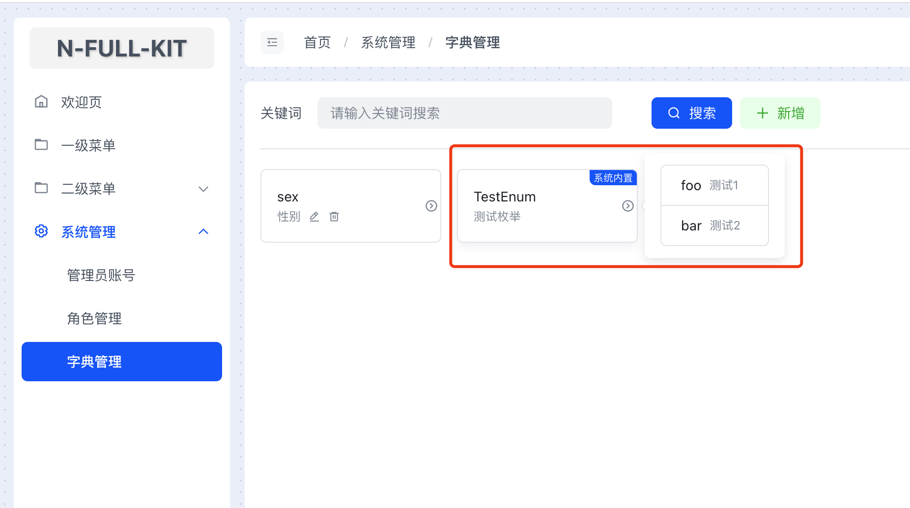

# 字典系统

## 概述

字典系统用于管理和维护项目中的枚举值。通过字典系统，可以方便地在前端和后端之间共享枚举数据，减少硬编码，提高代码的可维护性。

## 使用

### 定义枚举

在项目中任意位置定义枚举时，可以使用`@dict-label`和`@dict-value`注释来标注枚举名称和枚举值。例如：

```ts{1,3,5}
/** @dict-label 测试枚举 */ // [!code focus]
export enum TestEnum {
    /** @dict-value 测试1 */ // [!code focus]
    foo = 'foo',
    /** @dict-value 测试2 */ // [!code focus]
    bar = 'bar',
}
```
- `@dict-label` 标记当前枚举的名称
- `@dict-value` 标记当前枚举值的名称

> [!TIP] 提示
> - 只有标记了`@dict-label`和`@dict-value`注释的枚举才会被收集哦！

### 收集枚举
在运行`npm run start:dev`或`npm run build`时，会自动收集所有已标记的枚举，生成json数据写入在`static/enum.json`文件中。
例如上方示例的枚举，将生成如下json：
```json
[
  {
    "labelName": "测试枚举",
    "labelKey": "TestEnum",
    "options": [
      {
        "value": "foo",
        "label": "测试1"
      },
      {
        "value": "bar",
        "label": "测试2"
      }
    ]
  }
]
```

### 使用字典数据
生成的数据可自行处理，在本项目模板中，在`src/endpoints/admin/admin-dict`模块中，在首次启动时，将`static/enum.json`内的数据写入数据库，以实现字典系统的增删改查。   
本项目的字典系统除了自动收集外，还支持手动添加，所以自动收集的字典在`Admin后台管理系统`中显示`系统内置`标签，表示`不可编辑`和`不可删除`：
