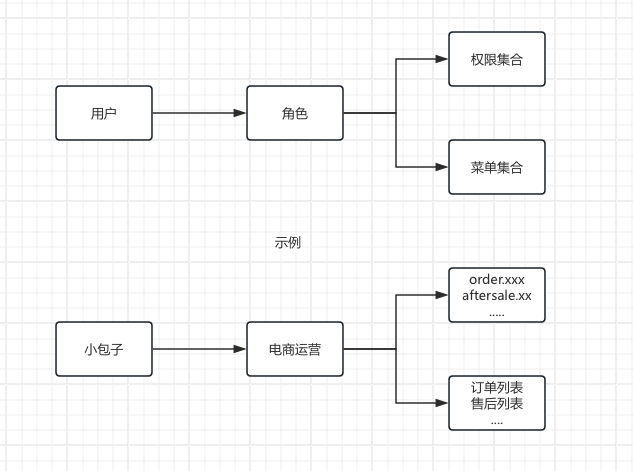
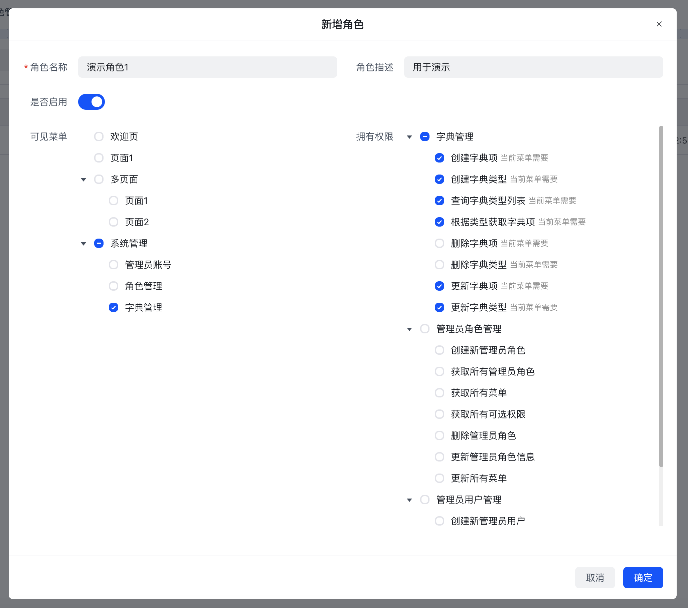
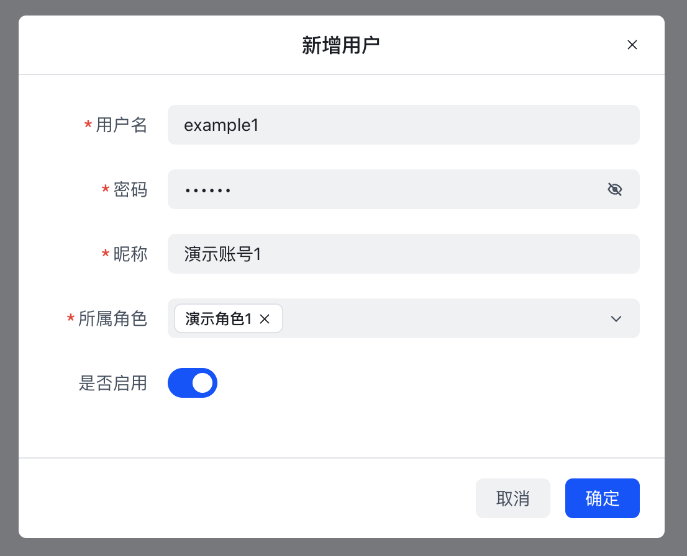
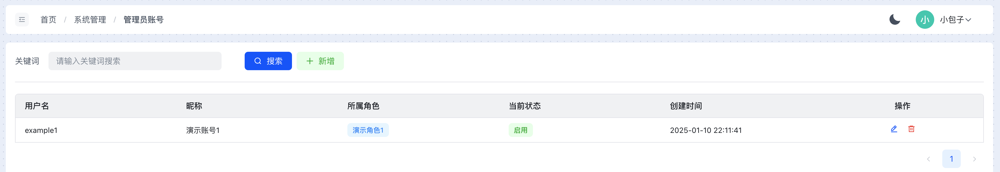
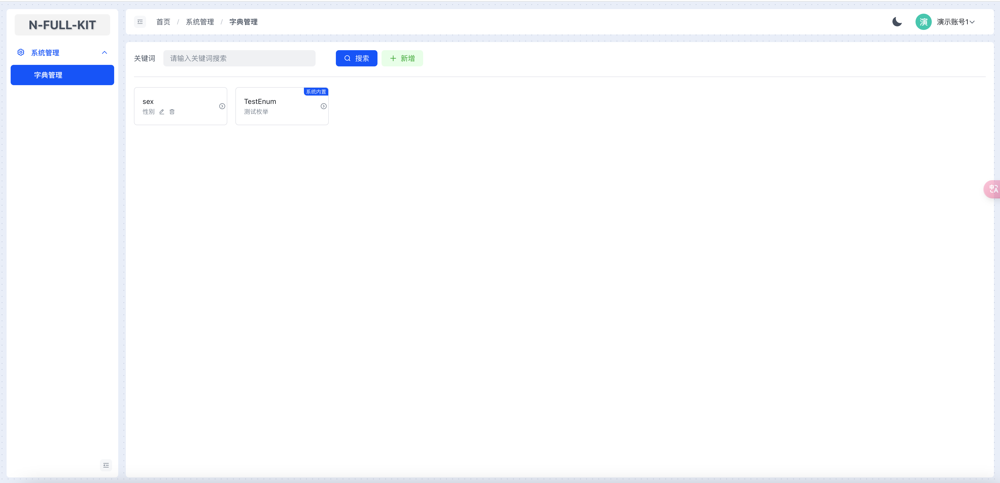
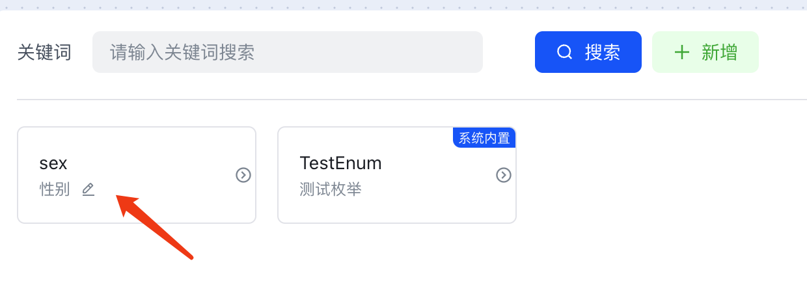
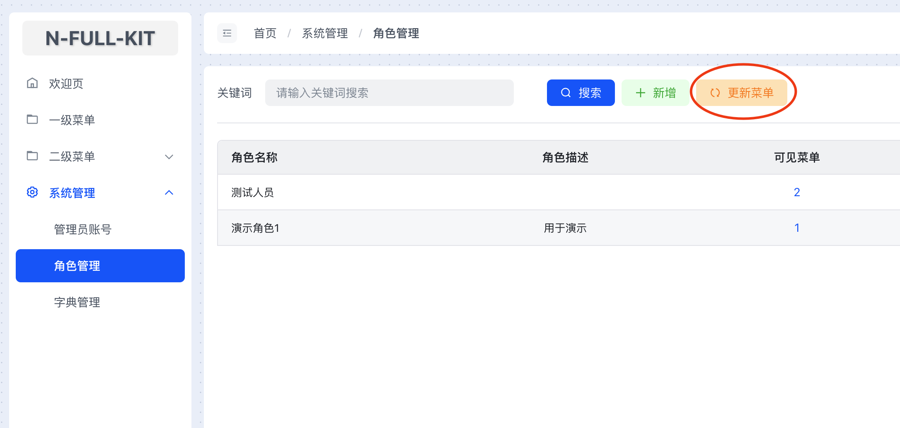

# RBAC权限

## 概述
本项目模板集成了简单且高效的`RBAC权限`认证方案。方案架构图如下：   



- 简单：本项目设计的权限系统没有过多的层级关系，仅仅是标准的`用户`-`角色`-`权限`三层结构。   
- 高效：代码启动时，自动运行收集所有被标记的接口，自动创建权限信息并写入数据库。如果前端结合`Vue3+Arco Design Admin`项目模板，将会在角色管理和菜单管理时联动权限选项，非常高效，下文将详细说明。

:::tip 提示
- 本项目中的权限系统，`菜单`和`权限`是分开独立的
- 一个用户可以绑定多个角色，当绑定多个角色时，用户拥有多个角色的菜单和权限
- 权限系统默认只作用于`admin`端点分类(对应前端的Admin后台管理)，设计初衷是默认为只有管理端才需要权限
:::

## 用法 - 后端
### 1. 标记权限接口
   使用`@PermissionGroup`装饰器，在`Controller`上进行标记，表示当前`Controller`是一个权限组，`Controller`下的方法会被识别为具体的权限项。
   ```ts{1}
   @PermissionGroup('admin-users', '管理员用户管理')
   export class AdminUsersController {
       @Post()
       @ApiOperation({ summary: '创建新管理员用户' })
       create(@Body() createAdminUserDto: CreateAdminUserDto) {
           return this.adminUsersService.create(createAdminUserDto);
       }
          
       @Get()
       @ApiOperation({ summary: '获取所有管理员用户' })
       findAll(@Query() query: QueryAdminUserDto) {
           return this.adminUsersService.findAll(query);
       }
   }
   ```
   - `@PermissionGroup(groupName: string, description: string)`
     - `groupName` 权限组名，建议英文，类似key
     - `description` 权限组描述，建议中文，类似title
   以上示例代码将会生成以下数据结构，并写入数据库：
   ```json
   [
    {
        "key": "admin.adminUsersControllerCreate",
        "description": "创建新管理员用户",
        "group": "admin-users",
        "groupDescription": "管理员用户管理",
    },
    {
        "key": "admin.adminUsersControllerFindAll",
        "description": "获取所有管理员用户",
        "group": "admin-users",
        "groupDescription": "管理员用户管理",
    }
   ]
   ```
   类似`admin.adminUsersControllerCreate`这样的权限key是由装饰器内部自动生成的，其命名规则与`swagger-typescript-api`插件保持一致，方便前端关联权限，后续前端篇会说明。

   如果一定要自定义权限key，可使用`@PermissionKey`装饰器在方法上装饰。
   ```ts{10}
   @PermissionGroup('admin-users', '管理员用户管理')
   export class AdminUsersController {
       @Post()
       @ApiOperation({ summary: '创建新管理员用户' })
       create(@Body() createAdminUserDto: CreateAdminUserDto) {
           return this.adminUsersService.create(createAdminUserDto);
       }
          
       @Get()
       @PermissionKey('my-custom-key','自定义描述') // [!code focus]
       @ApiOperation({ summary: '获取所有管理员用户' })
       findAll(@Query() query: QueryAdminUserDto) {
           return this.adminUsersService.findAll(query);
       }
   }
   ```
   生成如下结构：
   ```json
   [
    {
        "key": "admin.adminUsersControllerCreate",
        "description": "创建新管理员用户",
        "group": "admin-users",
        "groupDescription": "管理员用户管理",
    },
    {
        "key": "my-custom-key",// [!code focus:2]
        "description": "自定义描述",
        "group": "admin-users",
        "groupDescription": "管理员用户管理",
    }
   ]
   ```
:::tip 提示
- `@PermissionGroup`和`@PermissionKey`装饰器代码位于`src/common/decorators/permission.decorator.ts`
- 自动收集权限的代码位于`src/common/modules/permission-collect/`
- 数据库-权限表结构声明位于`src/endpoints/admin/admin-roles/entities/admin-permission.entity.ts`
:::
### 2. 拦截并检查权限
与上一章的`JWT身份认证`联动，如果使用了`@Auth(JwtStrategys.admin.name, true) `标记`控制器`或者`方法`，且第二参数是`true`，则表示在进行身份拦截时，同时拦截并检查权限：将会根据请求的用户id，判断该用户是否拥有请求`目标方法`所标记的`权限key`，如果权限未通过将会返回403错误。

如果有某些接口需要特殊处理，不进行权限检查，可以使用`@NoCheckRoles`装饰器装饰。
:::tip 提示
- 权限拦截逻辑位于`src/common/guards/roles.guard.ts`
- `@NoCheckRoles`装饰器代码位于`src/common/decorators/roles.decorator.ts`
:::

用户如何绑定上`权限key`，请看接下来的前端篇：

## 用法 - 前端
::: warning 提示
- 前端需结合`Vue3+Arco Design Admin`项目模板
:::
根据文章开头所述，本项目的权限架构是`用户`-`角色`-`权限`三层结构，也就是说要准备好三要素`用户`-`角色`-`权限`。
### 1.创建角色
运行前端`Vue3+Arco Design Admin`项目模板后，使用超级管理员账号登录，从左侧菜单进入`系统管理`-`角色管理`页面，点击按钮`新增`：

填写好`角色名称`和`角色描述`，并勾选该角色允许使用的`菜单项`后，右侧权限列表将自动提示该菜单项所有需要使用的`权限`，可以手动勾选，
点击`确定`即可创建角色。   
上图示例中，该角色拥有：
- 菜单项：
  - 字典管理
- 权限：
  - 创建字典项
  - 当前菜单需要
  - 创建字典类型
  - 查询字典类型列表
  - 根据类型获取字典项
  - 更新字典项
  - 更新字典类型
::: tip 提示
- [菜单选项从何而来](#_4-菜单用法)  
:::
### 2.创建用户并绑定角色
从左侧菜单进入`系统管理`-`管理员账号`页面，点击按钮`新增`：

在`所属角色`中关联刚才创建的角色`演示角色1`(这里可以选择多个角色)，点击`确定`即可创建用户。 
该用户拥有角色中的`菜单`和`权限`。


### 3.测试账号权限
右上角点击用户名，点击`退出登录`，切换成刚才创建的用户登录。
可以发现，右侧菜单仅仅只出现了当前账号角色所允许使用的菜单：

尝试点击`删除按钮`（刚才创建角色时，未勾选允许删除字典项目）：

提示<Badge type="danger" text="无权访问" />
在`删除按钮`的元素上使用前端模板内置的`v-permissions`标记该按钮所需的`权限key`:`v-permissions="['admin.adminDictControllerRemoveType']"`，由于当前账号没有删除权限，所以`删除按钮`会被隐藏：


### 4.菜单选项从何而来
`菜单`指的是前端后台管理页面中，`左侧菜单`的`菜单项`，它将提供`角色`勾选为可访问的菜单。   
**本项目的`Vue3+Arco Design Admin`模板与后端模板联动集成了自动上报菜单项的功能。**   

在前端项目路由表中声明的路由，在`root`部分下的`children`路由，会被自动识别为`菜单`：
```ts{14-127}
import frame from '@/components/frame/frame.vue'
import type { RouteRecordRaw } from 'vue-router'
const routes:Array<RouteRecordRaw>= [
    {
        path: '/',
        name: 'root',
        component: frame,
        meta:{
            title:"首页"
        },
		redirect:{
			name:"dashboard"
		},
        children:[ // [!code focus:113]
			{
				path: 'dashboard',
				name: 'dashboard',
				meta: {
					title: '欢迎页',
					icon: 'icon-home',
				},
				component: () => import('@/views/dashboard/index.vue')
			},
            {
                path: 'page1',
                name: 'page1',
                meta: {
                    title: '一级菜单',
                    icon: 'icon-folder',
                },
                component: () => import('@/views/page1/page1.vue')
            },
            {
                path: 'multi-page',
                name: 'multi-page',
                meta: {
                    title: '二级菜单',
                    icon: 'icon-folder',
                },
                children:[
                    {
                        path: 'page1',
                        name: 'multi-page-page1',
                        meta: {
                            title: '页面1',
                        },
                        component: () => import('@/views/page1/page1.vue')
                    },
                    {
                        path: 'page2',
                        name: 'multi-page-page2',
                        meta: {
                            title: '页面2',
                            hideInMenu: false
                        },
                        component: () => import('@/views/page2/page2.vue')
                    }
                ]
            },
			{
                path: 'system',
                name: 'system',
                meta: {
                    title: '系统管理',
                    icon: 'icon-settings',
                },
                children:[
                    {
                        path: 'account',
                        name: 'system-account',
                        meta: {
                            title: '管理员账号',
                            //前端声明该页面所用到的接口(权限),以便后端知道每一个页面默认有哪些权限
                            //权限名称为该页面所用到的api接口 格式为：api.aaa.bbbb()=>aaa.bbbb
							permissions:[
								'admin.adminUsersControllerFindAll',
                                'admin.adminRolesControllerFindAll',
                                'admin.adminUsersControllerUpdate',
                                'admin.adminUsersControllerCreate',
                                'admin.adminUsersControllerRemove'
							]
                        },
                        component: () => import('@/views/system/account/index.vue')
                    },
                    {
                        path: 'role',
                        name: 'system-role',
                        meta: {
                            title: '角色管理',
                            //前端声明该页面所用到的接口(权限),以便后端知道每一个页面默认有哪些权限
                            //权限名称为该页面所用到的api接口 格式为：api.aaa.bbbb()=>aaa.bbbb
                            permissions:[
                                'admin.adminRolesControllerFindAllPermissions',
                                'admin.adminRolesControllerFindAllMenus',
                                'admin.adminRolesControllerFindAll',
                                'admin.adminRolesControllerUpdate',
                                'admin.adminRolesControllerCreate',
                                'admin.adminRolesControllerRemove',
                                'admin.adminRolesControllerUpdateAllMenus'
                            ]
                        },
                        component: () => import('@/views/system/role/index.vue')
                    },
                    {
                        path: 'dict',
                        name: 'system-dict',
                        meta: {
                            title: '字典管理',
                            //前端声明该页面所用到的接口(权限),以便后端知道每一个页面默认有哪些权限
                            //权限名称为该页面所用到的api接口 格式为：api.aaa.bbbb()=>aaa.bbbb
                            permissions:[
                                'admin.adminDictControllerFindAllTypes',
                                'admin.adminDictControllerCreateType',
                                'admin.adminDictControllerUpdateType',
                                'admin.adminDictControllerRemoveType',
                                'admin.adminDictControllerFindByType',
                                'admin.adminDictControllerUpdate',
                                'admin.adminDictControllerRemove',
                                'admin.adminDictControllerCreate',
                            ]
                        },
                        component: () => import('@/views/system/dict/index.vue')
                    }
                ]
            }
        ]
    },
    {
        path: '/login',
        name: 'login',
        component: () => import('@/views/login/index.vue'),
        meta: {
            title: '登录'
        }
    },
    {
        path: '/:pathMatch(.*)*',
        name: '404',
        component: () => import('@/views/404/index.vue'),
        meta: {
            title: '404'
        }
    }
]

export default routes
```

`首次运行`或`每次变更路由`时，由具有`角色管理`权限的账号，在后台页面点击`更新菜单`按钮，即可自动上报菜单项。


更详细的前端向`RBAC权限`说明，请查看`Vue3+Arco Design Admin`模板的相关说明：[点击跳转](#)