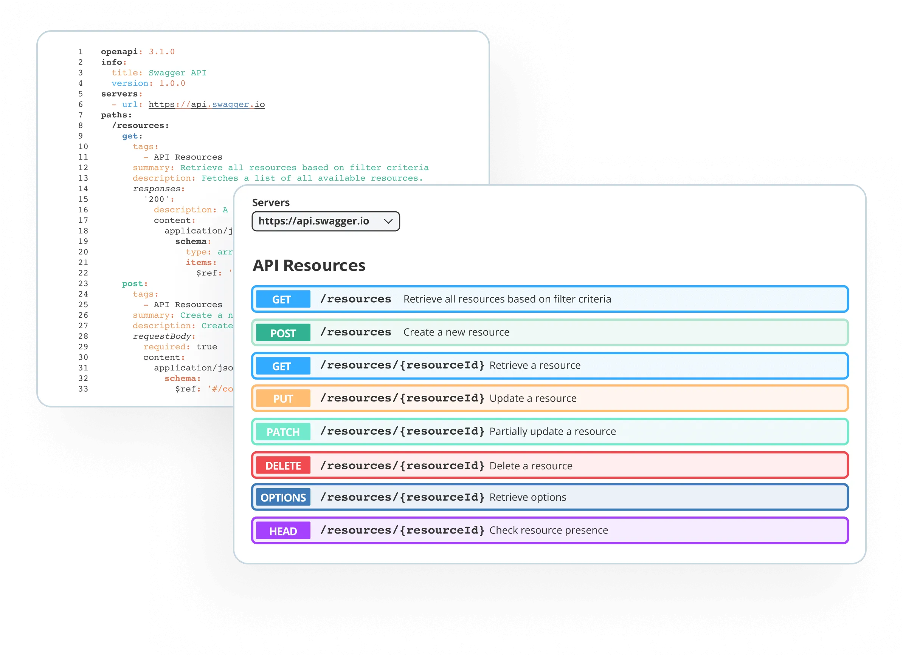
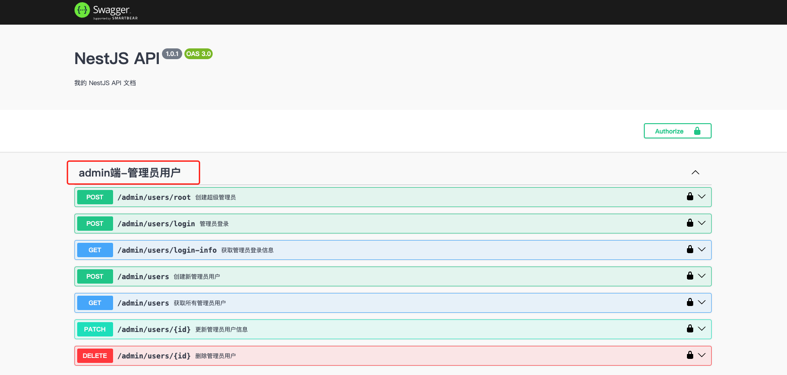
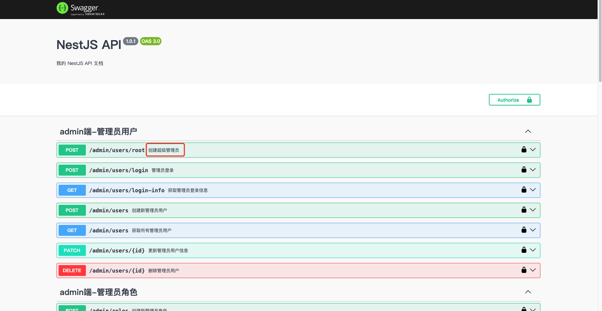
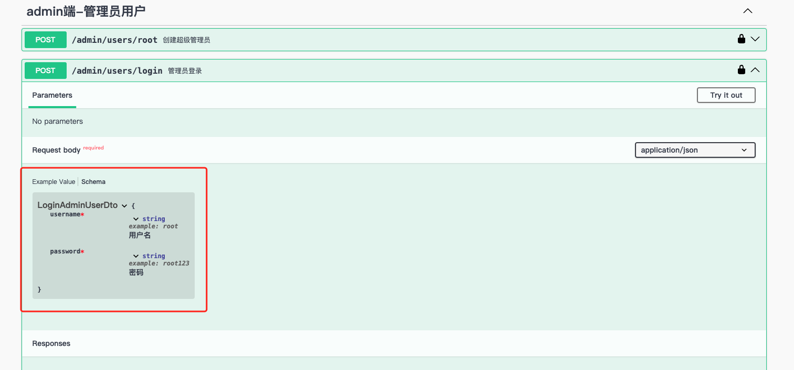
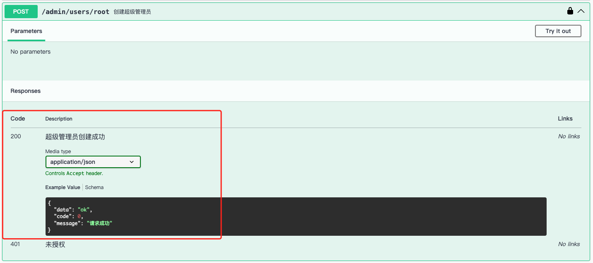

# Swagger文档

## 概述
现在的开发模式基本上都是`前后端分离`的模式，后端提供`API接口`给前端调用，那么`API文档`成了前后端开发人员联系的纽带。   

`OpenAPI`是一个编写`API文档`的规范，然而如果手动去编写`OpenAPI`规范的文档，是非常麻烦的。而`Swagger`就是一个实现了`OpenAPI`规范的工具集。   

`Swagger-UI`是一个用于可视化展示 Swagger/OpenAPI 规范文档的工具。它将定义好的 API 接口信息（如接口路径、请求方法、请求参数、响应内容等）以直观的用户界面形式呈现。开发人员、测试人员或者其他相关人员可以通过浏览器访问 `Swagger-UI` 界面，方便地查看和理解 API 的功能和使用方法，并且能够直接在界面上进行 API 调用测试，有助于提高 API 开发过程中的沟通效率、加快开发和测试进度，是 API 文档展示和交互测试的实用工具。

> [!NOTE] 参考
> - [Swagger官方文档](https://swagger.io/)

## 使用
本项目模板使用`@nestjs/swagger`包实现了自动生成`Swagger-UI`文档的功能。   

在`main.ts`中引入并初始化`swagger`模块：
```ts{3,8-32}
import { NestFactory } from '@nestjs/core';
import { RootModule } from './root.module';
import { SwaggerModule, DocumentBuilder } from '@nestjs/swagger';// [!code focus]

async function bootstrap() {
	const app = await NestFactory.create(RootModule);
    // ...
	// Swagger 配置 // [!code focus:25]
	const config = new DocumentBuilder() 
		.setTitle(configService.get('app.name', 'NestJS API'))
		.setDescription(configService.get('app.description', 'NestJS 启动模板 API 文档'))
		.setVersion(configService.get('app.version', '1.0.0'))
		.addBearerAuth(
			{
				type: 'http',
				scheme: 'bearer',
				bearerFormat: 'JWT',
				name: 'JWT',
				description: 'Enter JWT token',
				in: 'header',
			},
			'JWT-auth', // This name here is important for matching up with @ApiBearerAuth() in your controller!
		)
		.build();

	const document = SwaggerModule.createDocument(app, config);
	SwaggerModule.setup('swagger', app, document, {
		swaggerOptions: {
			persistAuthorization: true,
		},
		jsonDocumentUrl: 'swagger-json',
	});
    //...
}
bootstrap();

```
在项目启动后，访问`localhost:3000/swagger`即可打开`Swagger-UI`页面。

## 标注
要生成`Swagger-UI`的文档，需要我们在书写代码时，对关键部分代码进行标注，以便让`Swagger-UI`知道提取哪些信息用于生成API文档。   
一般情况下，书写一个API接口，我们需要知道如下信息：
- `请求地址` 例如：/app/users
- `请求方法` 例如：GET
- `请求参数` 例如：?page=1&pageSize=10
- `响应类型` 例如：{
    "data":"....",
    "code":0,
    "message":"请求成功"
}
- `接口描述` 例如：获取用户列表
- 更多其他辅助信息，非必须，本文暂不涉及，有需要的自行扩展研究

在本项目模板中使用`@nestjs/swagger`包进行生成`Swagger-UI`，所有的标注都是通过`@nestjs/swagger`提供的多种`装饰器`来进行：

### @ApiTags
`@ApiTags`标记在`Controller`上，表示当前`Controller`下的所有接口归为一个分组，分组名称为参数传入的字符串。
```ts{1-2}
import { ApiTags } from '@nestjs/swagger'; // [!code focus]
@ApiTags('admin端-管理员用户') // [!code focus]
export class AdminUsersController {
    //...
}
```

### @ApiOperation
`@ApiOperation`标记在`Controller`的`方法`上，用于描述当前`API接口`的信息。
`@ApiOperation`的参数是一个对象，常用的属性有：
- `summary`: 接口的简要描述
- `description`: 接口的详细描述
- `deprecated`: 是否废弃
- `tags`: 标签分组

示例：
```ts{1,7}
import { ApiOperation } from '@nestjs/swagger'; // [!code focus]
// ...
@ApiTags('admin端-管理员用户')
export class AdminUsersController {
    // ...
    @Post('root')
	@ApiOperation({ summary: '创建超级管理员' }) // [!code focus]
	@CustomApiResponse({
		type: String,
		example: "ok",
		description: "超级管理员创建成功",
	})
	createRoot() {
		return this.adminUsersService.createRoot();
	}
    // ...
}
```

> [!TIP]
> 建议为每个API接口都添加`@ApiOperation`装饰器，并填写恰当的描述信息，这对于团队协作和接口维护都很有帮助。

### @ApiProperty
`@ApiProperty`装饰器用于在DTO(数据传输对象)或实体类中标注属性的类型和描述信息。它帮助Swagger理解API请求和响应的数据结构。

常用属性说明：
- `description`: 属性的描述信息
- `example`: 示例值
- `required`: 是否必填，默认true
- `type`: 属性类型
- `enum`: 枚举值
- `default`: 默认值
- `minimum/maximum`: 数值范围
- `isArray`: 是否为数组

示例：
```ts{1,3,6}
import { ApiProperty } from '@nestjs/swagger'; // [!code focus]
export class LoginAdminUserDto {
    @ApiProperty({ description: '用户名', example: 'root',type:String }) // [!code focus]
    username: string;

    @ApiProperty({ description: '密码', example: 'root123',type:String }) // [!code focus]
    password: string;
}
```


> [!TIP]
> 确保为DTO中的每个属性都添加 `@ApiProperty` 装饰器，这样可以让API文档更加清晰完整，前端开发人员也能更好地理解数据结构。

### @ApiResponse
`@ApiResponse`装饰器用于描述API接口的响应信息。它可以定义不同HTTP状态码下的响应结构。

主要参数说明:
- `status`: HTTP状态码 
- `description`: 响应描述
- `type`: 响应数据类型
- `schema`: 自定义响应结构

示例:
```ts
@ApiResponse({
  status: 200,
  description: '请求成功',
  type: UserEntity
})
@ApiResponse({
  status: 403,
  description: '没有权限'
})
async findOne(): Promise<UserEntity> {
  // ...
}
```
考虑到我们在[统一响应结构](./response.md)中已经实现了统一的响应格式封装,如果继续使用`@ApiResponse`来标记每个接口的响应结构,会导致大量重复的响应结构声明。为了简化这个过程并保持响应文档的一致性,我们封装了`@CustomApiResponse`装饰器。

### @CustomApiResponse
`@CustomApiResponse`是本项目封装的一个自定义响应装饰器,用于统一处理API响应格式。它会自动包装标准的响应结构:

```ts
{
  data: T, // 实际响应数据
  code: number, // 业务状态码
  message: string // 响应消息
}
```

主要参数说明:
- `type`: 响应数据类型
- `example`: 示例数据 
- `description`: 响应描述
- `isList`: 是否为列表类型
- `isPage`: 是否为分页类型

基础用法示例:
```ts
@CustomApiResponse({
  type: String,
  example: "success",
  description: "创建成功"
})
async create() {
  return "success";
}
```

列表响应示例:
```ts
@CustomApiResponse({
  type: UserEntity,
  isList: true,
  description: "用户列表"
})
async findAll() {
  return [/* user list */];
}
```

分页响应示例:
```ts
@CustomApiResponse({
  type: UserEntity,
  isPage: true,
  description: "分页用户列表"
})
async findPage() {
  return {
    list: [/* user list */],
    total: 100,
    page: 1,
    pageSize: 10
  };
}
```

> [!TIP] 
> - 推荐使用`@CustomApiResponse`来统一API响应格式
> - 根据实际返回数据结构选择合适的参数配置
> - 建议都添加`description`描述,提高文档可读性
> - `@CustomApiResponse`源码位于`src/common/decorators/api-response.decorator.ts`
> - 更多`@CustomApiResponse`的实际使用示例，请参考`src/endpoints/admin/admin-users/admin-users.controller.ts`

## 总结
本文介绍了项目中最常用的几个Swagger装饰器及其使用方法：
- `@ApiTags` - 用于API分组
- `@ApiOperation` - 描述API接口信息
- `@ApiProperty` - 标注DTO属性
- `@CustomApiResponse` - 统一响应结构

需要特别注意的是:
1. `@ApiProperty`是使用频率最高的装饰器，建议**耐心的为每个DTO中的属性都定义精准的类型和添加详细的描述信息，因为如果你打算搭配使用`N-Full-Kit`的前端项目模板(admin前端、小程序、app、桌面客户端等等)，这些项目模板会使用工具自动从swagger文档中生成对应的前端请求代码，而代码中关于参数类型和注释描述的部分就来源于`@ApiProperty`的信息标注，它将影响所有前端项目的开发效率和开发体验。即便不使用`N-Full-Kit`的前端项目模板，编写一个严谨而完整文档也是一个好的习惯**。
2. 使用`@CustomApiResponse`可以确保API文档的响应结构与实际响应保持一致
3. 编写API文档时应当站在调用方的角度，提供清晰、准确的接口说明

@nestjs/swagger还提供了更多实用的装饰器，如：
- `@ApiParam` - 路径参数说明
- `@ApiQuery` - 查询参数说明
- `@ApiHeader` - 请求头说明
- `@ApiBody` - 请求体说明

更多高级用法请参考:
- [NestJS Swagger官方文档](https://docs.nestjs.com/openapi/introduction)
- [OpenAPI规范](https://swagger.io/specification/)
- [@nestjs/swagger API文档](https://docs.nestjs.com/openapi/types-and-parameters)