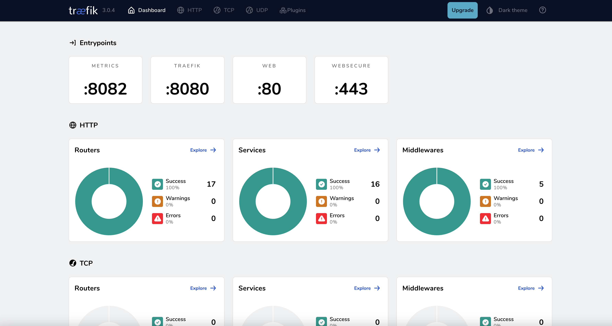
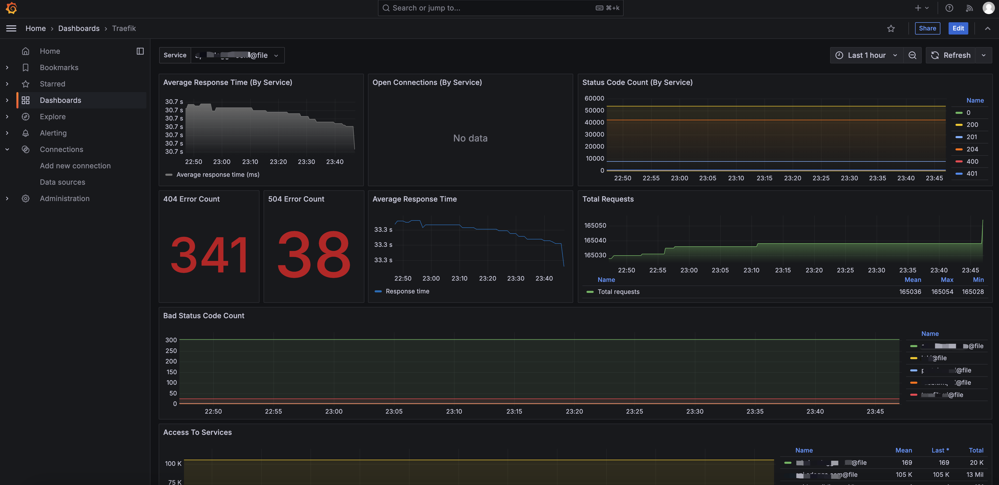
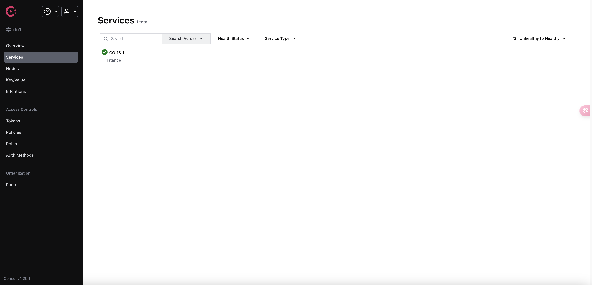
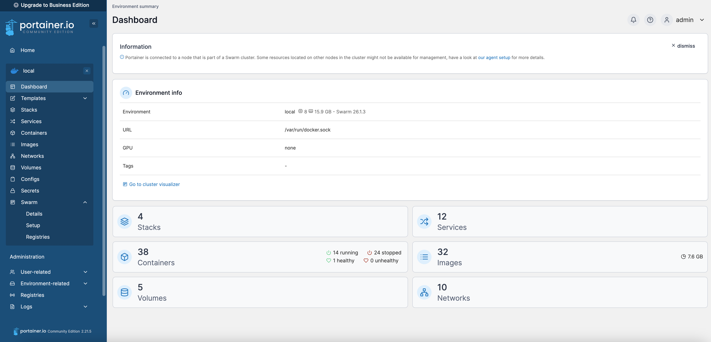

# Traefik 套件

## 概述
Traefik 套件是一个完整的服务代理和监控解决方案，包含以下组件：

- **Traefik**：现代化的反向代理和负载均衡器（代替Nginx）
- **Grafana**：强大的可视化监控仪表盘
- **Prometheus**：指标收集和存储系统
- **Consul**：服务发现和配置管理
- **Loki**：日志聚合系统
- **Promtail**：日志收集代理
- **Portainer**：轻量级 Docker 容器管理界面，提供可视化的容器管理功能

该套件适用于以下场景：
- 微服务架构的服务代理
- 实时监控和告警
- 日志集中管理
- 服务发现和配置管理

## 快速部署
本项目的`n-full-cli`提供`Traefik 套件`的docker部署配置样板文件。
1. 在准备存放项目的目录下，使用`n-full-cli`工具输入命令创建：
2. 输入命令：`nfull inject`
3. 选择：`Traefik suite`

```sh:no-line-numbers{7}
T  nfull inject
|
o  ? Please select the configuration you want to pop up / 请选择想要弹出的配置
|    MySQL 
|    MongoDB 
|    Redis 
|  ❯ Traefik suite - (traefik+grafana+prometheus+consul+loki+promtail)
|
o  Template downloaded successfully to ./traefik-suite
|  
|  To get started, navigate to the project directory:
|  cd traefik-suite
|  docker-swarm: run 'docker stack deploy -c docker-compose.yml traefik'
|  docker-compose: run 'docker-compose up -d
```

以下是docker配置样板文件源码：
::: code-group
```yml [docker-compose.yml]
version: '3.9'

services:
  traefik:
    image: traefik:v3.0
    container_name: traefik
    restart: unless-stopped
    security_opt:
      - no-new-privileges:true
    ports:
      - "80:80"     # HTTP
      - "443:443"   # HTTPS
      - "8080:8080" # Dashboard
      - "8082:8082" # Metrics
    logging:
      driver: "json-file"
      options:
        max-size: "100m"
        max-file: "20"
    volumes:
      - /var/run/docker.sock:/var/run/docker.sock
      - ./config/traefik.yml:/etc/traefik/traefik.yml
      - ./config/vhost:/etc/traefik/vhost
      - ./certs:/etc/certs
      - ./logs:/var/log/traefik
      - ./acme/acme.json:/etc/traefik/acme.json
    networks:
      - swarm_network
    labels:
      - "traefik.enable=true"

  grafana:
    image: grafana/grafana:latest
    container_name: grafana
    environment:
      - GF_SECURITY_ADMIN_PASSWORD=admin
    ports:
      - "3000:3000"
    volumes:
      - grafana-storage:/var/lib/grafana  # 添加卷挂载
    networks:
      - swarm_network

  prometheus:
    image: prom/prometheus:latest
    container_name: prometheus
    volumes:
      - ./config/prometheus.yml:/etc/prometheus/prometheus.yml
      - prometheus-storage:/prometheus  # 数据持久化挂载
    ports:
      - "9090:9090"
    networks:
      - swarm_network

  consul:
    image: hashicorp/consul:latest
    container_name: consul
    environment:
      - CONSUL_LOCAL_CONFIG={"acl":{"enabled":true,"default_policy":"deny","enable_token_persistence":true,"tokens":{"master":"admin","agent":"admin"}}}
    command: agent -server -bootstrap-expect=1 -client=0.0.0.0 -ui -bind=127.0.0.1
    ports:
      - "8500:8500"  # Consul UI
      - "8600:8600"  # DNS
    volumes:
      - consul-data:/consul/data
    networks:
      - swarm_network

  loki:
    image: grafana/loki:latest
    container_name: loki
    restart: unless-stopped
    ports:
      - "3100:3100"  # Loki API端口
    volumes:
      - loki-data:/data/loki  # 持久化存储 Loki 数据
      - ./loki/config.yaml:/etc/loki/loki-config.yaml  # Loki 配置文件挂载
    networks:
      - swarm_network

  promtail:
    image: grafana/promtail:latest
    container_name: promtail
    restart: unless-stopped
    volumes:
      - ./promtail/config.yml:/etc/promtail/config.yml  # Promtail 配置文件挂载
      - ./logs:/var/log/traefik  # Traefik 日志目录挂载
    networks:
      - swarm_network

  portainer:
    image: portainer/portainer-ce:latest
    container_name: portainer
    ports:
      - "9000:9000" # Web界面访问
      - "8000:8000" # Edge Agent通信（可选）
    volumes:
      - /var/run/docker.sock:/var/run/docker.sock # 绑定宿主机的Docker Socket
      - portainer_data:/data # 数据存储
    networks:
      - swarm_network
    restart: unless-stopped
   

networks:
  swarm_network:
    driver: bridge

volumes:
  consul-data:
  grafana-storage:
  prometheus-storage:
  loki-data:
  portainer_data:
```
```yml [docker-swarm.yml]
version: '3.9'

services:
  traefik:
    image: traefik:v3.0
    deploy:
      replicas: 1
      placement:
        constraints:
          - node.role == manager
    restart: unless-stopped
    security_opt:
      - no-new-privileges:true
    ports:
      - target: 80
        published: 80
        protocol: tcp
        mode: host
      - target: 443
        published: 443
        protocol: tcp
        mode: host
      - "8080:8080" # Dashboard
      - "8082:8082" # metrics
    logging:
      driver: "json-file"
      options:
        max-size: "20m"
        max-file: "20"
    volumes:
      - /var/run/docker.sock:/var/run/docker.sock
      - ./config/traefik.yml:/etc/traefik/traefik.yml
      - ./config/vhost:/etc/traefik/vhost
      - ./logs:/var/log/traefik
      - ./acme/acme.json:/etc/traefik/acme.json
    networks:
      - swarm_network
    labels:
      - "traefik.enable=true"

  grafana:
    image: grafana/grafana:latest
    deploy:
      replicas: 1
    environment:
      - GF_SECURITY_ADMIN_PASSWORD=admin
    ports:
      - "8100:3000"
    volumes:
      - grafana-storage:/var/lib/grafana  # 添加卷挂载
    networks:
      - swarm_network

  prometheus: #推荐grafana面板导入id=17035/4475
    image: prom/prometheus:latest
    deploy:
      replicas: 1
      placement:
        constraints:
          - node.role == manager
    volumes:
      - ./config/prometheus.yml:/etc/prometheus/prometheus.yml
      - prometheus-storage:/prometheus  # 数据持久化挂载
    ports:
      - "9090:9090"
    networks:
      - swarm_network

  consul:
    image: hashicorp/consul
    deploy:
      replicas: 1
    environment:
      - CONSUL_LOCAL_CONFIG={"acl":{"enabled":true,"default_policy":"deny","enable_token_persistence":true,"tokens":{"master":"admin","agent":"admin"}}}
    command: agent -server -bootstrap-expect=1 -client=0.0.0.0 -ui -bind=127.0.0.1
    ports:
      - "8500:8500"  # Consul UI
      - "8600:8600"  # DNS
    volumes:
      - consul-data:/consul/data
    networks:
      - swarm_network

  loki:
    image: grafana/loki:latest
    container_name: loki
    restart: unless-stopped
    deploy:
      replicas: 1  # Swarm 模式下设置副本数
      placement:
        constraints:
          - node.role == manager  # 使 Loki 运行在 Swarm Manager 节点上
    ports:
      - "3100:3100"  # Loki API端口
    volumes:
      - loki-data:/data/loki  # 持久化存储 Loki 数据
      - ./loki/config.yaml:/etc/loki/loki-config.yaml  # Loki 配置文件挂载
    networks:
      - swarm_network

  promtail:
    image: grafana/promtail:latest
    container_name: promtail
    restart: unless-stopped
    deploy:
      replicas: 1
      placement:
        constraints:
          - node.role == manager  # 使 Promtail 运行在 Swarm Manager 节点上
    volumes:
      - ./promtail/config.yml:/etc/promtail/config.yml  # Promtail 配置文件挂载
      - ./logs:/var/log/traefik  # Traefik 日志目录挂载
    networks:
      - swarm_network
  
  portainer:
    image: portainer/portainer-ce:latest
    ports:
      - "9000:9000" # Web界面访问
      - "8000:8000" # Edge Agent通信（可选）
    volumes:
      - /var/run/docker.sock:/var/run/docker.sock # 绑定宿主机的Docker Socket
      - portainer_data:/data # 数据存储
    networks:
      - swarm_network
    restart: unless-stopped
    deploy:
      mode: replicated
      replicas: 1
      placement:
        constraints:
          - node.role == manager # 在Swarm模式下仅运行在管理节点（可选）

networks:
  swarm_network:
    external: true

volumes:
  consul-data:
  grafana-storage:
  prometheus-storage:
  loki-data:
  portainer_data:
```
:::

:::tip 提示
- 使用`docker-swarm`模式时，请先创建 swarm_network 网络：
  - 创建`swarm_network`网络命令：docker network create --driver overlay --attachable swarm_network
  - 运行`docker-swarm.yml`命令：docker stack deploy -c docker-swarm.yml traefik_suite
:::

## 配置目录
导出的目录结构如下：

```bash
.
├── acme/                  # Let's Encrypt 证书存储目录
│   └── acme.json          # ACME 证书文件，存储自动申请的 SSL 证书
├── config/                # 配置文件目录
│   ├── prometheus.yml     # Prometheus 监控系统配置文件
│   ├── traefik.yml        # Traefik 主配置文件，包含全局配置和入口点设置
│   └── vhost/             # 虚拟主机配置目录
│       └── config.yml     # 各服务的路由规则配置
├── logs/                  # 日志文件目录
│   ├── access.log         # Traefik 访问日志，记录所有 HTTP 请求
│   └── traefik.log        # Traefik 运行日志，记录服务运行状态和错误信息
├── loki/                  # Loki 日志系统配置目录
│   └── config.yaml        # Loki 配置文件，定义日志收集和存储规则
├── promtail/              # Promtail 日志收集代理配置目录
│   └── config.yml         # Promtail 配置文件，定义日志收集规则和目标
├── docker-compose.yml     # Docker Compose 配置文件
└── docker-swarm.yml       # Docker Swarm 配置文件
```
## 启动
### 1. 启动服务

推荐使用`Docker Swarm`启动所有服务，确保你已经设置好 Docker Swarm 环境。然后，在终端运行以下命令启动服务：

::: code-group
```bash [Docker Swarm]
// 创建 名为swarm_network 的overlay 网络 如果已存在请忽略
docker network create -d overlay swarm_network 
docker stack deploy -c docker-swarm.yml traefik_suite
```
```bash [Docker Compose]
docker compose up -d
```
:::

### 2. 配置文件说明

- `Traefik`：在 ./config/traefik.yml 和 ./config/vhost/config.yml 配置文件中配置 Traefik 的路由规则和服务发现。
- `Prometheus`：在 ./config/prometheus.yml 配置文件中配置 Prometheus 要采集的服务和目标。
- `Loki`：在 ./loki/config.yaml 配置文件中配置 Loki 的存储和日志收集规则。
- `Promtail`：在 ./promtail/config.yml 配置文件中配置 Promtail 的日志收集规则。

### 2. 配置认证

#### 2.1 Traefik

如果你希望为 Traefik 的 Web UI (Dashboard) 配置认证，编辑 config/vhost/config.yml 文件，并启用基本认证：

```yaml
#... 10-14行
    auth:
      basicAuth:
        users:
          - "admin:$apr1$lrta7Zzl$.GiLJOz0/gSKS.Tl/tY1a/" # 格式为 username:password 用 htpasswd 生成加密的密码 示例：htpasswd -nb admin password
        removeHeader: true
#...
```

#### 2.2 Grafana

Grafana 的管理员密码在 `docker-swarm.yml`/`docker-compose.yml` 文件中配置：

```yaml
  grafana:
    image: grafana/grafana:latest
    deploy:
      replicas: 1
    environment:
      - GF_SECURITY_ADMIN_PASSWORD=admin
    ports:
      - "3000:3000"
    volumes:
      - grafana-storage:/var/lib/grafana  # 添加卷挂载
    networks:
      - swarm_network
```
如果你想要更改 Grafana 的用户名或密码，可以修改此配置。

#### 2.3 Consul

在 `docker-swarm.yml`/`docker-compose.yml` 中，已为 Consul 配置了默认的 ACL 令牌：

```yaml
  consul:
    image: hashicorp/consul
    deploy:
      replicas: 1
    environment:
      - CONSUL_LOCAL_CONFIG={"acl":{"enabled":true,"default_policy":"deny","enable_token_persistence":true,"tokens":{"master":"admin","agent":"admin"}}}
    command: agent -server -bootstrap-expect=1 -client=0.0.0.0 -ui -bind=127.0.0.1
    ports:
      - "8500:8500"  # Consul UI
      - "8600:8600"  # DNS
    volumes:
      - consul-data:/consul/data
    networks:
      - swarm_network
```
默认配置中，master 和 agent 令牌的密码均为 admin。如果需要修改密码或权限，可以在 Consul 的配置文件中进行修改，或者在 UI 中设置。

#### 2.4 Loki   
如需为`Loki`设置身份认证，以便在`非内网环境`下访问，请使用`traefik`为`Loki`配置反向代理来启用基本认证。
在`config/vhost`中新建`loki.yml`，写入以下配置：
```yml
http:
  middlewares:
    loki-auth:
      basicAuth:
        users: #配置basicAuth 格式为 username:password 用 htpasswd 生成加密的密码 示例：htpasswd -nb admin password
          - "admin:$apr1$RPk.W/Gx$CXnMsG87hTHGBbmsyvxxn."
  routers:
    loki:
      entryPoints:
        - web
      rule: "PathPrefix(`/loki`)" #代理路径或者域名 根据需求自行修改
      service: loki
      middlewares:
        - loki-auth
  
  services:
    loki:
      loadBalancer:
        servers:
          - url: "http://loki:3100"
```

#### 2.5 Prometheus   
Prometheus 不需要专门的认证配置。如果你希望为 Prometheus 配置认证，可以在 traefik 中配置反向代理来启用基本认证，参考[2.4 Loki](#_2-4-loki)。

### 3. 访问服务
- `Traefik Dashboard`: 访问 http://localhost:8080/dashboard，默认用户名和密码均为 admin。
- `Grafana`: 访问 http://localhost:3000，默认管理员密码是你在 `docker-swarm.yml`/`docker-compose.yml` 中设置的（例如 admin）。
- `Consul UI`: 访问 http://localhost:8500，默认master 和 agent 令牌的密码均为 admin。
- `Loki API`: 访问 http://localhost:3100。
- `Portainer`: 访问 http://localhost:9000

## 示例截图
### Traefik

### Grafana

### Consul

### Portainer

