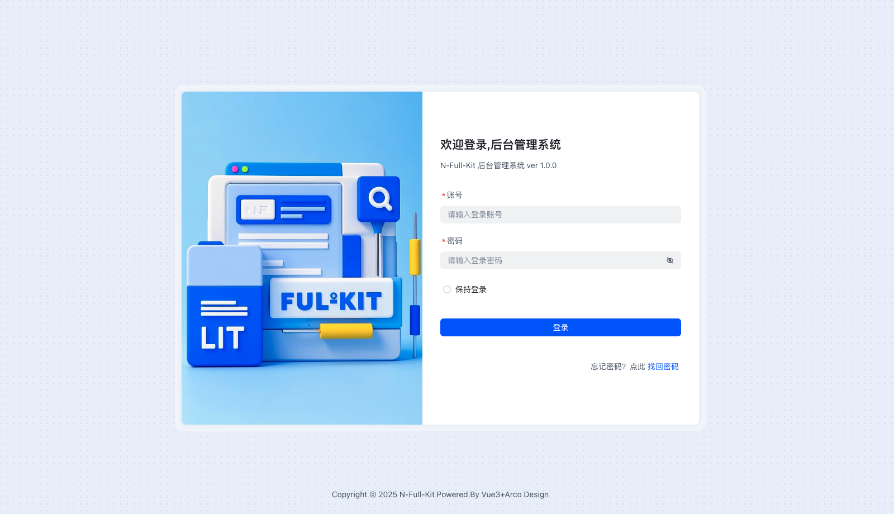
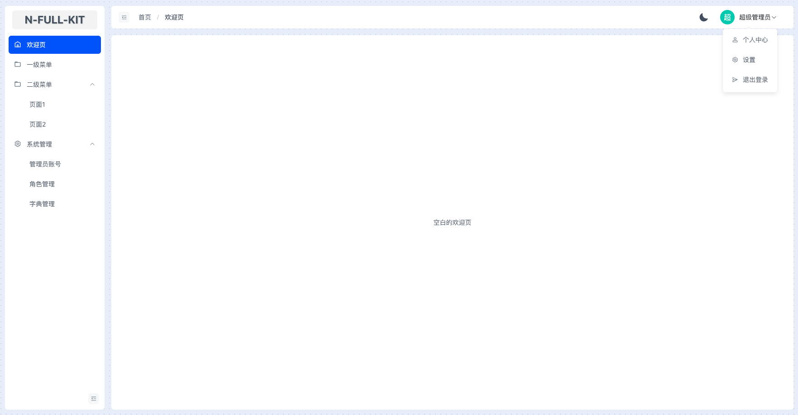
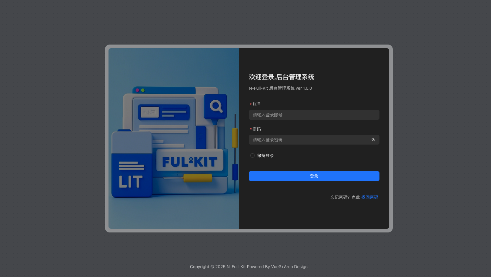
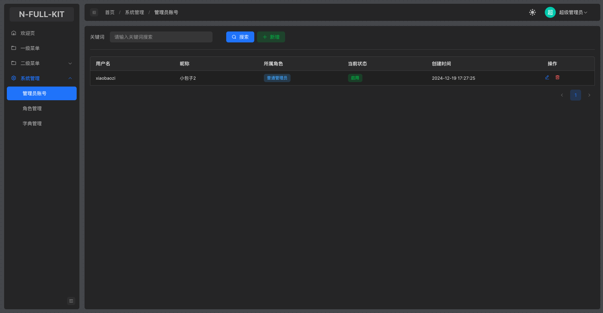

# 快速开始

## 概述
`Vue3+Arco Design Admin`是本项目提供了一个用于后台管理的前端项目模板，它包含的技术栈：
- `vue3` 主框架
- `Arco Design Admin` UI库
- `pinia` 状态管理库
- `swagger-typescript-api` 自动根据`swagger文档`生成前端请求代码
  
以下是部分页面截图：





::: warning 注意
- 使用本模板需要具有一定Vue3开发经验。
- 本模板除了开发项目必备的一些基础设置外，不会过多封装组件，特别是业务相关的封装，避免造成模板大量冗余代码。
- 本模板初衷是快速搭建一个用后台管理的项目模板，它已经准备好必要的基础设置，但尽可能减少多余的组件封装代码，不会像其他同类型的项目模板那样，开局就是十几二十个封装组件和演示页面，实际做项目时，还得删除这些演示页面。
- 为了联动后端项目，故本模板仅内置了几个开箱即用的功能页面，如`管理员账号`、`角色管理`、`字典管理`。如果还想要更加纯净的模板，请选择`Vue3+Arco Design Admin pure` 。
:::

## 创建项目
1. 在准备存放项目的目录下，使用`n-full-cli`工具输入命令创建：
2. 输入命令：`nfull create`
3. 选择：`frontend / 前端`
4. 选择：`Vue3+Arco Design Admin`
5. 输入项目名称并确定，它将会按照名称创建一个项目目录

```sh:no-line-numbers{5,9}
T  nfull create
|
o  Please select the project type / 请选择项目类型
|    backend / 后端 
|  ❯ frontend / 前端 
|
o  Please select a backend template / 请选择项目模板
|  ❯ Vue3+Arco Design Admin 
|    Vue3+Arco Design Admin pure 
|    Flutter+GetX 
|    Uniapp+NutUI 
|    Electron+Vue+Nest 
|
o  Please enter the project name: / 请输入你的项目名称
|  admin-project
| 
o  downloading template...
|
o  Template downloaded successfully to ./admin-project
|
|  To get started, navigate to the project directory:
|  cd admin-project
|  Then run the following command to install dependencies:
|  npm install or yarn install
-  npm run dev
```
::: tip 提示
如果不需要联动前后端模板，仅仅只需要一个纯净的前端模板，请选择`Vue3+Arco Design Admin pure`   
纯净模板不包含：
- RBAC权限系统
- 管理账号登录以及相应的增删改查
- 字典系统
:::
## 项目目录
本项目的目录结构如下：
```
src
├── App.vue //入口组件
├── api
│   ├── api.ts //由swagger-typescript-api自动生成的api请求代码
│   └── index.ts //导出请求代码
├── assets //资源目录
├── base.css //样式初始化文件
├── common //公共代码目录
├── components //公共组件目录
├── directives //自定义指令目录
├── main.ts //入口文件
├── routes //路由目录
├── store //状态管理目录
├── theme.scss //主题样式修改文件
├── utils //工具类目录
├── views //所有视图目录
```