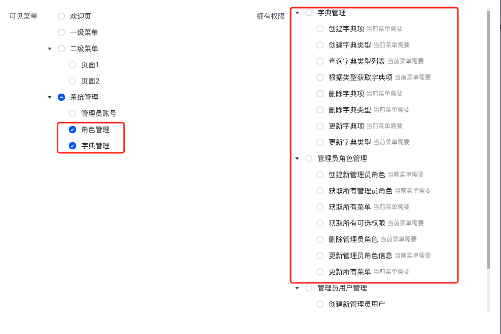

# RBAC权限

## 概述
本项目模板集成了简单且高效的`RBAC权限`认证方案。方案架构图如下：   


关于`RBAC权限`的后端部分请阅读[此处](../../backend/nestjs-starter/rbac.md)。
- 简单：本项目设计的权限系统没有过多的层级关系，仅仅是标准的`用户`-`角色`-`权限`三层结构。   
- 高效：后端结合`NestJS+Mysql`或`NestJS+Mongo`项目模板，将会在角色管理和菜单管理时联动权限选项，非常高效，下文将详细说明。

:::tip 提示
- 本项目中的权限系统，`菜单`和`权限`是分开独立的
- 一个用户可以绑定多个角色，当绑定多个角色时，用户拥有多个角色的菜单和权限
:::

## 可见菜单
在创建`角色`时，可勾选允许该`角色`访问的`菜单项`。   
从左侧菜单进入`系统管理`-`角色管理`页面，点击按钮`新增`：

可以看到弹窗左侧有待勾选的`菜单项`列表，这个列表就是来源于后端数据库中记录的`菜单项`，以往其他的同类型项目模板，一般需要在后台手动录入`菜单项`到后端数据库中。而在本模板中，只需要点击`更新菜单`按钮即可自动上报菜单项。

:::tip 提示
首次运行或每次变更路由时，由具有角色管理权限的账号，在后台页面点击更新菜单按钮，即可自动上报或更新菜单项
:::

## 拥有权限
在创建`角色`时，可勾选该`角色`拥有的`权限`，这里的`权限`本质上是指具体的`接口访问权限`。 如上图所示，示例中的角色拥有字典管理的大部分`接口访问权限`，但没有`删除字典项`和`删除字典类型`的权限，那么当该角色访问这两个接口时，将报`403错误`：


**从使用者角度出发：** 后台管理系统最终使用人员，大部分`并非开发者本人`，而可能是公司的`运营人员`或者其他`管理层`。他们在操作`创建角色`功能时，并不知道`哪些功能`需要勾选`哪些权限`。由此，本模板设计了自动提示功能，当勾选任何`可见菜单`时，右侧的权限列表都将提示对应`需要的权限`，此功能的实现，需要`前端开发者`在`路由配置`中提前标记每一个页面需要用到`哪些权限`，因为只有前端开发者才知道。

标记的方式为：在路由声明的`meta`信息中使用`permissions`数组声明该页面会使用到哪些`权限key`
```ts{30-36}
import frame from '@/components/frame/frame.vue'
import type { RouteRecordRaw } from 'vue-router'
const routes:Array<RouteRecordRaw>= [
    {
        path: '/',
        name: 'root',
        component: frame,
        meta:{
            title:"首页"
        },
		redirect:{
			name:"dashboard"
		},
        children:[ 
            {
                path: 'system',
                name: 'system',
                meta: {
                    title: '系统管理',
                    icon: 'icon-settings',
                },
                children:[
                    {
                        path: 'account',
                        name: 'system-account',
                        meta: { // [!code focus:12]
                            title: '管理员账号',
                            //前端声明该页面所用到的接口(权限),以便后端知道每一个页面默认有哪些权限
                            //权限名称为该页面所用到的api接口 格式为：api.aaa.bbbb()=>aaa.bbbb
							permissions:[
								'admin.adminUsersControllerFindAll',
                                'admin.adminRolesControllerFindAll',
                                'admin.adminUsersControllerUpdate',
                                'admin.adminUsersControllerCreate',
                                'admin.adminUsersControllerRemove'
							]
                        },
                        component: () => import('@/views/system/account/index.vue')
                    },
                    //...
                ]
            }
        ]
    },
    //...
]

export default routes
```
前端如何知道`permissions`数组中的`权限key`应该填什么呢？以往的开发方式，还得与后端开发沟通或者查看文档才能得知每一个接口的`权限key`。   
但在本项目模板中，如果后端配套使用的是`NestJS+Mysql`或`NestJS+Mongo`项目模板，事情就变得非常简单了：
1. 在本项目模板下运行`npm run genApi`命令即可自动从后端提供的`swagger文档`生成前端的请求代码
2. 在需要调用接口时，可以直接调用生成好的请求代码，它的调用示例如`api.admin.adminUsersControllerFindAll()`
3. 当你在一个页面中使用多个接口完成了该页面的功能后，将该页面所用到的所有接口方法名填写到`permissions`数组，方法名`admin.adminUsersControllerFindAll`即为该接口的`权限key`。
   
关于自动从后端提供的`swagger文档`生成前端的请求代码，详情请看这里[生成请求代码](./swagger-api.md)。

## 按钮隐藏
页面中的很多按钮一般都对应着需要某种权限的操作，当我们希望角色在没有该权限时，不展示该按钮，我们可以使用本模板中封装的`v-permissions`指令标记该元素，当角色没有权限时，将不会渲染该元素。示例：
```vue
<icon-delete v-permissions="['admin.adminDictControllerRemoveType']"></icon-delete>
```
- `v-permissions`传递的是一个数组，当角色未拥有数组内的任何`权限key`时，该元素不会渲染。

:::tip 提示
- `v-permissions`源码位于`src/directives/permission.ts`
:::