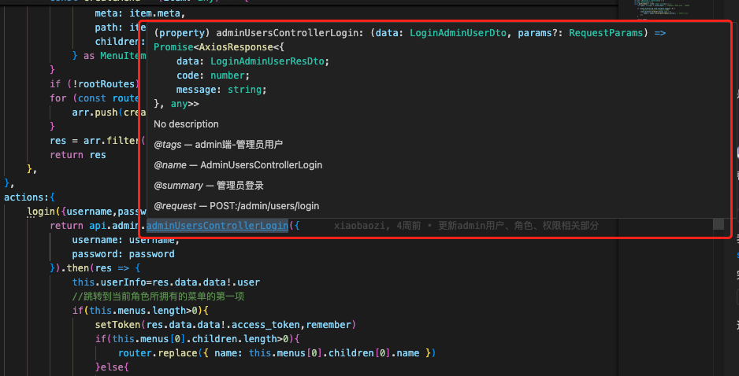

# 生成请求代码

## 概述
还在一边阅读接口文档一边手敲接口请求代码吗？本模板借助`swagger-typescript-api`这个库，快速将后端`swagger文档`转换生成前端请求代码，让前端开发更加高效。

通过自动生成的方式，我们可以获得以下好处：

- **类型安全** - 自动生成的TypeScript类型定义，确保请求参数和响应数据的类型正确性
- **代码一致** - 与后端API保持同步，减少手动编写带来的错误
- **效率提升** - 无需手动编写重复的请求代码，专注于业务逻辑开发
- **文档即代码** - 后端Swagger文档的变更会自动反映到前端代码中
- **智能提示** - IDE可以提供完整的代码补全和类型提示

本项目已经集成了代码生成工具，并对生成的代码进行了定制优化：

- 自动适配项目的请求封装
- 支持接口描述信息的同步
- 生成友好的类型定义

> [!TIP]
> 要使用此功能，需要确保后端服务已启动并开放了swagger文档访问

## 配置
在`package.json`的`scripts`中，默认配置了`genApi`命令：
```json{10}
{
  "name": "arco-vue-admin",
  "private": true,
  "version": "0.0.0",
  "type": "module",
  "scripts": {
    "dev": "vite",
    "build": "vue-tsc -b && vite build",
    "preview": "vite preview",
    "genApi": "swagger-typescript-api -p http://localhost:3000/swagger-json -o ./src/api -n api.ts --axios" // [!code focus]
  },
  "dependencies": {
    "axios": "^1.7.9",
    "dayjs": "^1.11.13",
    "pinia": "^2.3.0",
    "sass-embedded": "^1.83.0",
    "vue": "^3.5.13",
    "vue-router": "^4.5.0"
  },
  "devDependencies": {
    "@arco-design/web-vue": "^2.56.3",
    "@vitejs/plugin-vue": "^5.2.1",
    "swagger-typescript-api": "13.0.22",
    "typescript": "~5.6.2",
    "unplugin-auto-import": "^0.19.0",
    "unplugin-vue-components": "^0.27.5",
    "vite": "^6.0.1",
    "vue-tsc": "^2.1.10"
  }
}
```
- `-p` 后端提供的`swagger`json服务地址，也可以是静态的json文件
- `-o` 代码输出目录
- `-n` 生成的代码文件名
- `--axios` 使用`axios`作为http请求库
  
生成的文件在`src/api/api.ts`，并且由`src/api/index.ts`实例化并导出，`src/api/index.ts`还能进行响应拦截之类的额外处理：
```ts
// src/api/index.ts
import { AxiosError, AxiosResponse, InternalAxiosRequestConfig } from "axios";
import { Api } from "./api";
import { router } from "@/routes";
import { Message } from "@arco-design/web-vue";
import { getToken, removeToken } from "@/utils/token";

export const api = new Api({
    baseURL: 'http://localhost:3000',
})
api.instance.interceptors.request.use((config:InternalAxiosRequestConfig) => {
	let token=getToken()
	if(token){
		config.headers.Authorization = `Bearer ${token}`
	}
    return config;
})
api.instance.interceptors.response.use((res:AxiosResponse) => {
    return Promise.resolve(res)
}, (err:AxiosError) => {
    if(err.response?.status===401){
        Message.error('未登录或登录已过期，请重新登录')
        removeToken()
        router.replace('/login')
    }else{
		//@ts-ignore
		Message.error(err.response?.data.message)
	}
    return Promise.reject(err.response);
})

```
可以根据项目需求，自行更改`src/api/index.ts`的逻辑。

## 使用
在需要调用接口的地方，导入`import { api } from '@/api';`，即可使用`api`实例调用已转换好的请求方法：
```ts
api.admin.adminUsersControllerLogin({})
```
调用格式为`api.aaa.bbbb()`:
- `aaa` 代表接口分组，由`swagger-typescript-api`自动生成，生成依据是实际请求口的第一个`path`，例如实际请求路径为`/admin/users/login`，第一个`path`是`/admin`，那么`aaa`=`admin`
- `bbbb()` 接口请求方法，由`swagger-typescript-api`自动生成，生成依据是`aaa`+`后端控制器类名`+`控制器方法名`

生成的代码具有良好的`TS类型提示`。当然，这取决于后端开发时，文档标注是否细致和准确。点击查看[后端文档标注](../../backend/nestjs-starter/swagger.md#标注)

:::tip 提示
- `aaa.bbbb`拼接的字符串，例如`admin.adminUsersControllerLogin`，即代表该接口的`权限key`
:::