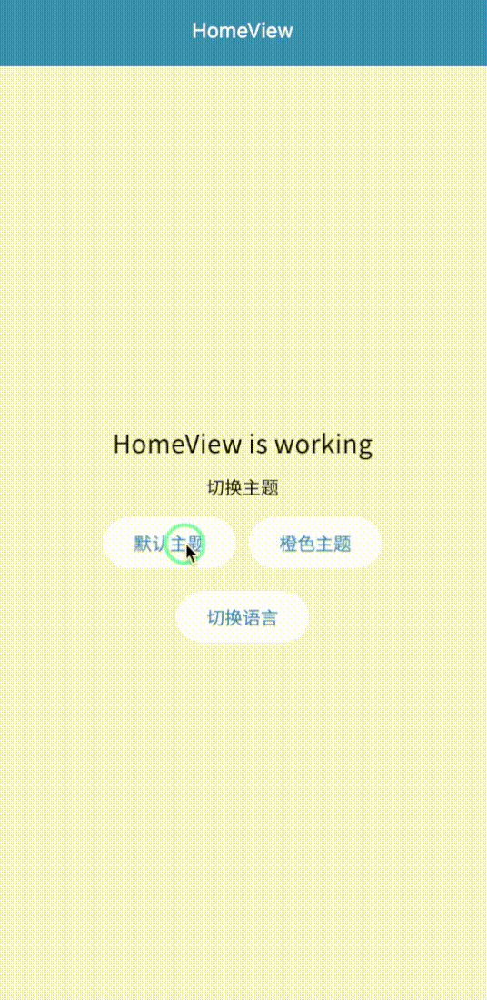

# 主题与多语言

## 主题切换

项目使用GetX实现主题切换功能，内置`默认`和`橙色`两种主题作为代码示例，实际开发项目时，须根据设计稿自行重新定制主题。

### 使用方法
1. 定制主题   
在`lib/theme`目录下新建主题文件，通过flutter的`ThemeData`类自行定制主题，示例：
```dart
import 'package:flutter/material.dart';

Color primaryColor=Colors.blue;
Color primaryLite=const Color.fromARGB(255, 220, 237, 252);
Color warningColor=const Color(0xffE98E65);
Color dangerColor=const Color(0xffff7071);

ThemeData get defaultThemeData=> ThemeData(
	platform: TargetPlatform.iOS,
	primaryColor:primaryColor,
	primaryColorLight:primaryLite,
	scaffoldBackgroundColor:const Color(0xfff6f6f7),
	fontFamily: 'SourceHanSansCN',
	textTheme: const TextTheme(
		bodyLarge: TextStyle(fontSize: 24.0,color: Color(0xff111111)),
		bodyMedium: TextStyle(fontSize: 14.0,color: Color(0xff111111)),
		bodySmall: TextStyle(fontSize: 12.0,color: Color(0xff999999)),
	),
	textSelectionTheme:TextSelectionThemeData(
		cursorColor: primaryColor,
		selectionColor: primaryColor.withOpacity(0.5),
		selectionHandleColor: primaryColor
	),
	appBarTheme: const AppBarTheme(
		centerTitle:true,
		backgroundColor: Colors.blue,
		elevation: 0,
		iconTheme: IconThemeData(
			color: Colors.white,
			size: 18
		),
		titleTextStyle:TextStyle(fontSize: 16,color: Colors.white),
		toolbarTextStyle: TextStyle(fontSize: 16,color: Colors.white),
		actionsIconTheme: IconThemeData(
			color: Colors.white,
			size: 18
		),
	),
	bottomNavigationBarTheme: BottomNavigationBarThemeData(
		selectedItemColor:primaryColor,
	),
	inputDecorationTheme: const InputDecorationTheme(
		hintStyle: TextStyle(color: Color(0xffc6c6c6))
	),
	elevatedButtonTheme: const ElevatedButtonThemeData(
		style: ButtonStyle(
			elevation: WidgetStatePropertyAll<double>(0),
		)
	),
	textButtonTheme: TextButtonThemeData(
		style: ButtonStyle(
			overlayColor: const WidgetStatePropertyAll(Colors.transparent),
			foregroundColor:WidgetStateProperty.resolveWith((states) {
				if (states.contains(WidgetState.pressed)) {
					return Colors.black54.withOpacity(0.8);
				}
				return Colors.black54;
			})
		)
	),
	radioTheme: RadioThemeData(
		fillColor: WidgetStatePropertyAll(primaryColor)
	), colorScheme: ColorScheme.fromSwatch().copyWith(
		secondary: warningColor,
	).copyWith(error: dangerColor),
);
```
2. 导出主题   
将定义好的主题在`lib/theme/theme.dart`中的`themeList`声明：
```dart{20-23}
import 'package:flutter/material.dart';
import 'package:get/get.dart';
import 'default.dart';
import 'orange.dart';
import 'package:sp_util/sp_util.dart';

class ThemeItem{
	String name;
	ThemeData data;
	ThemeItem({required this.name,required this.data});
}

class AppTheme {
	/// 默认主题
	static ThemeData defaultTheme=defaultThemeData;

	/// 橙色主题
	static ThemeData orangeTheme=orangeThemeData;

	static List<ThemeItem>themeList=[ // [!code focus:4]
		ThemeItem(name: "默认",data: defaultTheme),
		ThemeItem(name: "橙色",data: orangeTheme),
	];

	/// 切换主题
	static changeTheme(String themeName){
		var theme=themeList.firstWhere((item)=>item.name==themeName,orElse:() => themeList[0]);
		SpUtil.putString('currentThemeName', theme.name);
		Get.changeTheme(theme.data);
	}

	/// 获取当前主题
	static ThemeItem getCurrentTheme(){
		var currentThemeName=SpUtil.getString('currentThemeName')??"默认";
		var currentTheme=themeList.firstWhere((item)=>item.name==currentThemeName,orElse:() => themeList[0]);
		return currentTheme;
	}
}
```
3. 获取当前主题   
由`AppTheme`静态类提供静态方法`getCurrentTheme`获取当前主题，默认返回`themeList`中的第一个主题
```dart
var currentTheme = AppTheme.getCurrentTheme();
```

4. 切换主题   
由`AppTheme`静态类提供静态方法`changeTheme`切换主题
```dart 
AppTheme.changeTheme('橙色');
```

### 实现原理

- 主题功能由`GetX`框架提供，`AppTheme`静态类只是对框架功能的封装
- `changeTheme`和`getCurrentTheme`方法通过`SpUtil`将主题持久化，以便再次启动应用时能使用上一次选择的主题

## 多语言支持

项目使用`GetX`实现多语言支持，内置中英文两种语言作为代码示例。

### 使用方法

1. 在`lib/l18n/translations.dart`中定义翻译文本：(如果是国内开发者，建议使用中文作为key)
```dart
class AppTranslations extends Translations {
  @override
  Map<String, Map<String, String>> get keys => {
    'en_US': {
      '登录': 'Login',
      '切换语言': 'Switch Language',
    },
    'zh_CN': {
      '登录': '登录', 
      '切换语言': '切换语言',
    }
  };
}
```

2. 在任何需要翻译文本的地方使用`$key.tr`：   
**注意：** 字符串后面加上`.tr`即表示使用`GetX`的多语言功能，它将尝试从`translations`文件中寻找对应`key`的语言，如果没有找到则显示普通字符串
```dart
Text('登录'.tr);
```

3. 切换语言：
```dart
Get.updateLocale(Locale('en', 'US'));
```

### 实现原理

- 继承`Translations`类实现多语言映射
- 使用Map结构存储翻译文本
- 通过`tr`扩展方法获取翻译文本
- 使用`Get.updateLocale()`切换语言

## 截图演示
